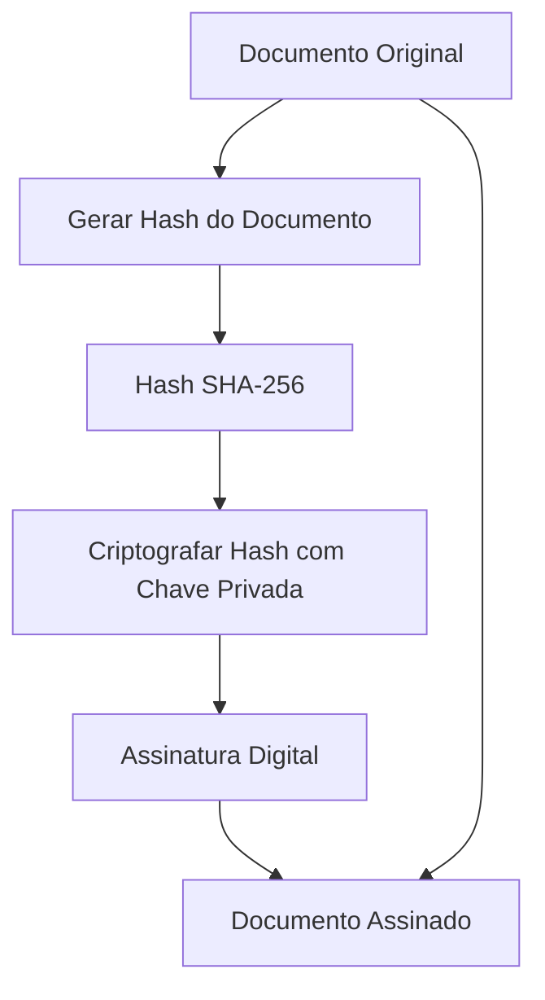
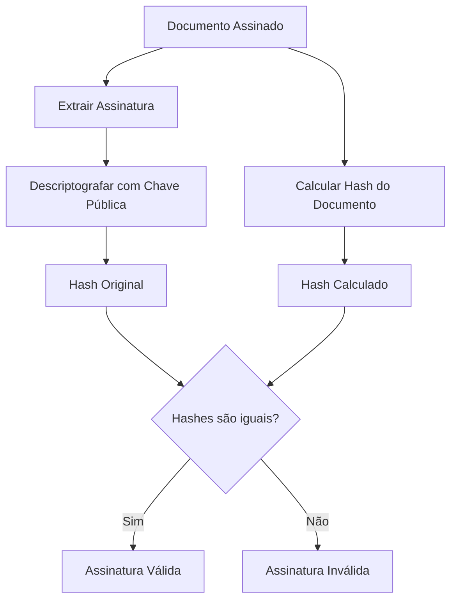
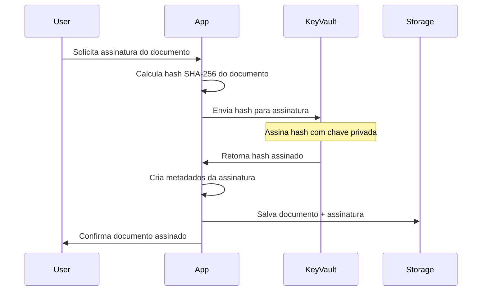
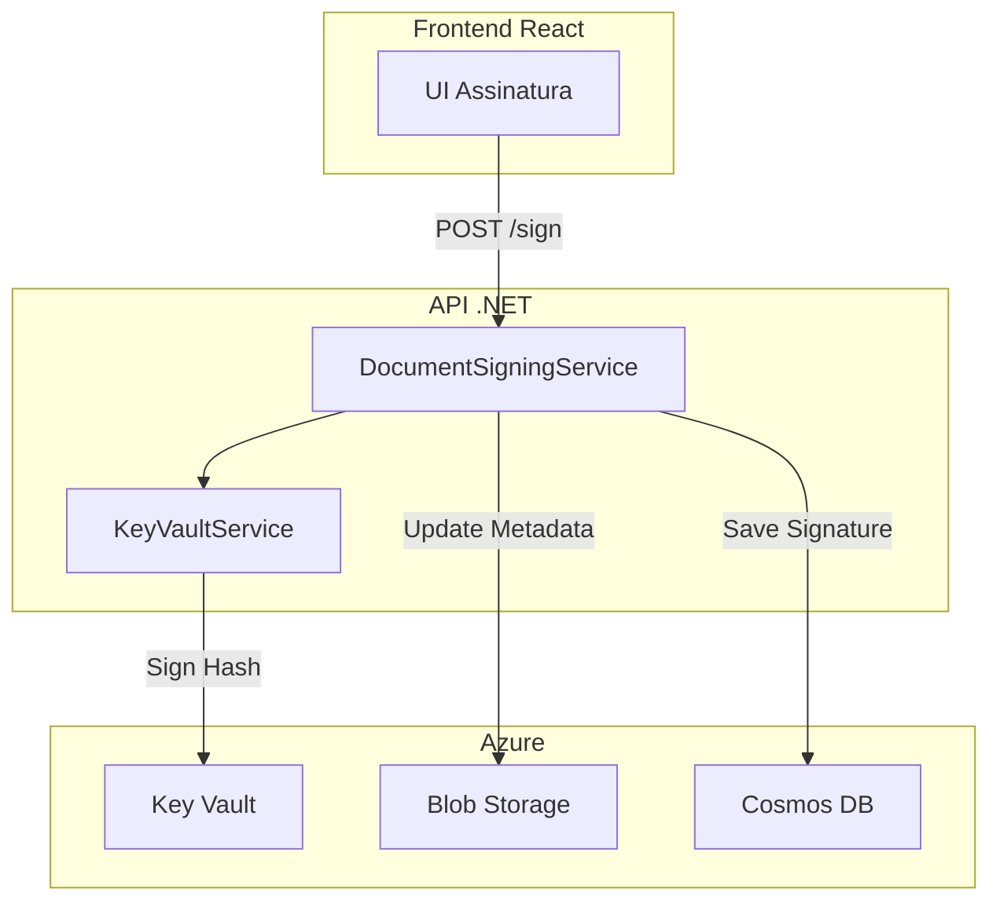

# Assinatura Digital de Documentos com Azure Key Vault

## Índice

1. [Conceitos de Assinatura Digital](#conceitos-de-assinatura-digital)
2. [Como Funciona a Assinatura Digital](#como-funciona-a-assinatura-digital)
3. [Azure Key Vault no Processo](#azure-key-vault-no-processo)
4. [Implementação no SecureDocManager](#implementação-no-securedocmanager)
5. [Próximos Passos](#próximos-passos)

## Conceitos de Assinatura Digital

### O que é Assinatura Digital?

A assinatura digital é um mecanismo criptográfico que garante:

- **Autenticidade**: Confirma a identidade do signatário
- **Integridade**: Garante que o documento não foi alterado após a assinatura
- **Não-repúdio**: O signatário não pode negar que assinou o documento
- **Timestamping**: Registra quando o documento foi assinado

### Diferença entre Assinatura Digital e Eletrônica

- **Assinatura Eletrônica**: Qualquer forma eletrônica de indicar consentimento (ex: digitar nome, clicar "Concordo")
- **Assinatura Digital**: Usa criptografia de chave pública/privada com certificados digitais

## Como Funciona a Assinatura Digital

### 1. Processo de Assinatura



**Passos detalhados:**

1. **Hash do Documento**: Um hash criptográfico (SHA-256) é calculado do conteúdo do documento
2. **Criptografia do Hash**: O hash é criptografado usando a chave privada do signatário
3. **Anexação**: A assinatura digital é anexada ao documento original

### 2. Processo de Verificação



**Passos detalhados:**

1. **Extração**: A assinatura digital é extraída do documento
2. **Descriptografia**: Usando a chave pública, descriptografa-se a assinatura para obter o hash original
3. **Recálculo**: Calcula-se novamente o hash do documento
4. **Comparação**: Se os hashes coincidirem, a assinatura é válida

### 3. Componentes Essenciais

#### Certificado Digital

- Contém a chave pública do signatário
- Informações de identidade (nome, email, organização)
- Assinado por uma Autoridade Certificadora (CA)
- Tem prazo de validade

#### Par de Chaves Criptográficas

- **Chave Privada**: Mantida em segredo pelo signatário
- **Chave Pública**: Distribuída livremente através do certificado

## Azure Key Vault no Processo

### O que é Azure Key Vault?

O Azure Key Vault é um serviço de nuvem para armazenar e acessar segredos de forma segura:

- **Chaves criptográficas**
- **Certificados digitais**
- **Segredos (senhas, strings de conexão)**

### Benefícios do Key Vault para Assinatura Digital

#### 1. Gerenciamento Seguro de Chaves

```yaml
Características:
  - Armazenamento em HSM (Hardware Security Module)
  - Chaves nunca saem do Key Vault em texto claro
  - Operações criptográficas realizadas dentro do serviço
  - Conformidade com FIPS 140-2 Level 2
```

#### 2. Controle de Acesso

```yaml
Funcionalidades:
  - RBAC (Role-Based Access Control)
  - Políticas de acesso granulares
  - Integração com Azure AD
  - Logs de auditoria completos
```

#### 3. Gerenciamento de Certificados

```yaml
Recursos:
  - Importação de certificados existentes
  - Geração de novos certificados
  - Renovação automática
  - Integração com CAs públicas
```

### Fluxo de Assinatura com Key Vault



### Vantagens de Usar Key Vault

1. **Segurança Aprimorada**
   - Chaves privadas nunca são expostas
   - Proteção contra vazamento de chaves
   - Backup e recuperação automáticos

2. **Conformidade**
   - Atende requisitos regulatórios
   - Trilha de auditoria completa
   - Certificações de segurança

3. **Escalabilidade**
   - Alta disponibilidade
   - Performance consistente
   - Sem gerenciamento de infraestrutura

4. **Integração**
   - APIs REST simples
   - SDKs para múltiplas linguagens
   - Integração nativa com serviços Azure

## Implementação no SecureDocManager

### Arquitetura Proposta



### Componentes Necessários

#### 1. Serviço de Assinatura

```csharp
public interface IDocumentSigningService
{
    Task<SignatureResult> SignDocumentAsync(string documentId, string userId);
    Task<bool> VerifySignatureAsync(string documentId);
    Task<SignatureInfo> GetSignatureInfoAsync(string documentId);
}
```

#### 2. Integração com Key Vault

```csharp
public interface IKeyVaultService
{
    Task<byte[]> SignDataAsync(byte[] hash, string keyName);
    Task<bool> VerifySignatureAsync(byte[] data, byte[] signature, string keyName);
    Task<X509Certificate2> GetCertificateAsync(string certificateName);
}
```

#### 3. Modelo de Dados

```csharp
public class DocumentSignature
{
    public string DocumentId { get; set; }
    public string SignedBy { get; set; }
    public DateTime SignedAt { get; set; }
    public string SignatureData { get; set; }
    public string CertificateThumbprint { get; set; }
    public string HashAlgorithm { get; set; }
    public string SignatureAlgorithm { get; set; }
}
```

### Fluxo de Implementação

1. **Configuração do Key Vault**

   ```bash
   # Criar Key Vault
   az keyvault create --name SecureDocKV --resource-group AZ204-RG
   
   # Criar certificado
   az keyvault certificate create --vault-name SecureDocKV \
     --name DocSigningCert --policy @policy.json
   ```

2. **Permissões Necessárias**

   ```bash
   # Dar permissões à aplicação
   az keyvault set-policy --name SecureDocKV \
     --spn <app-id> \
     --key-permissions sign verify \
     --certificate-permissions get list
   ```

3. **Configuração no appsettings.json**

   ```json
   {
     "KeyVault": {
       "VaultUri": "https://securedockv.vault.azure.net/",
       "CertificateName": "DocSigningCert",
       "SigningKeyName": "DocSigningKey"
     }
   }
   ```

## Próximos Passos

### 1. Implementação Básica

- [ ] Criar serviço de assinatura no backend
- [ ] Integrar com Azure Key Vault
- [ ] Implementar endpoint de assinatura na API
- [ ] Atualizar UI para mostrar status de assinatura

### 2. Funcionalidades Avançadas

- [ ] Múltiplas assinaturas por documento
- [ ] Workflow de aprovação
- [ ] Verificação de assinatura independente
- [ ] Exportação com certificado embarcado

### 3. Conformidade e Segurança

- [ ] Implementar timestamping (carimbo de tempo)
- [ ] Adicionar suporte a diferentes algoritmos
- [ ] Criar relatórios de auditoria
- [ ] Implementar verificação de revogação

### 4. Melhorias de UX

- [ ] Preview do documento antes de assinar
- [ ] Notificações de documentos para assinar
- [ ] Dashboard de documentos assinados
- [ ] Histórico de assinaturas

### Código de Exemplo

#### Assinando um Documento

```csharp
public async Task<SignatureResult> SignDocumentAsync(string documentId, string userId)
{
    // 1. Buscar documento
    var document = await _documentService.GetAsync(documentId);
    
    // 2. Calcular hash
    using var stream = await _blobService.DownloadAsync(document.BlobPath);
    var hash = SHA256.HashData(stream);
    
    // 3. Assinar hash com Key Vault
    var signature = await _keyVaultService.SignDataAsync(hash, "DocSigningKey");
    
    // 4. Salvar assinatura
    var signatureInfo = new DocumentSignature
    {
        DocumentId = documentId,
        SignedBy = userId,
        SignedAt = DateTime.UtcNow,
        SignatureData = Convert.ToBase64String(signature),
        HashAlgorithm = "SHA256",
        SignatureAlgorithm = "RS256"
    };
    
    await _cosmosService.SaveSignatureAsync(signatureInfo);
    
    // 5. Atualizar documento
    document.IsDigitallySigned = true;
    await _documentService.UpdateAsync(document);
    
    return new SignatureResult { Success = true, SignatureId = signatureInfo.Id };
}
```

#### Verificando uma Assinatura

```csharp
public async Task<bool> VerifySignatureAsync(string documentId)
{
    // 1. Buscar assinatura
    var signature = await _cosmosService.GetSignatureAsync(documentId);
    
    // 2. Buscar documento atual
    var document = await _documentService.GetAsync(documentId);
    
    // 3. Recalcular hash
    using var stream = await _blobService.DownloadAsync(document.BlobPath);
    var currentHash = SHA256.HashData(stream);
    
    // 4. Verificar com Key Vault
    var signatureBytes = Convert.FromBase64String(signature.SignatureData);
    return await _keyVaultService.VerifySignatureAsync(
        currentHash, 
        signatureBytes, 
        "DocSigningKey"
    );
}
```

## Conclusão

A implementação de assinatura digital com Azure Key Vault fornece uma solução robusta, segura e escalável para o SecureDocManager. O Key Vault elimina a complexidade de gerenciar chaves criptográficas enquanto mantém os mais altos padrões de segurança.

Com esta arquitetura, o sistema estará preparado para:

- Assinar documentos de forma segura
- Verificar a autenticidade e integridade
- Manter conformidade regulatória
- Escalar conforme necessário

O próximo passo é começar a implementação seguindo a ordem proposta, começando pela integração básica com o Key Vault.
